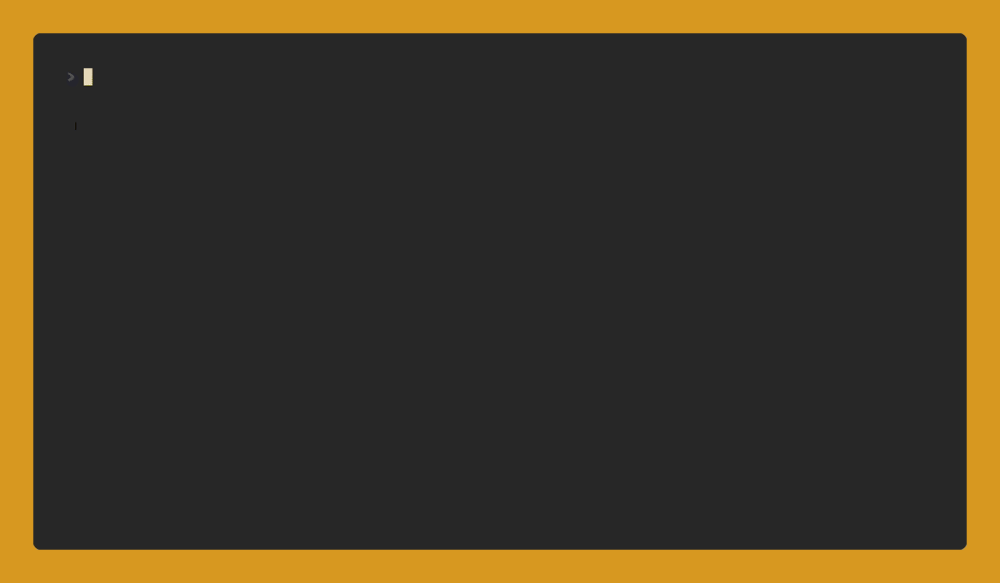

<div align="center">

# g8dbg

[](https://github.com/GabrielTecuceanu/g8dbg/actions)
[](go.mod)
[](https://goreportcard.com/report/github.com/GabrielTecuceanu/g8dbg)
[](LICENSE)

a CHIP-8 debugger written in go



</div>

## Features

- **Debugger REPL** - step, continue, set breakpoints, inspect memory/registers/timers/keys, and inject input.
- **Context view** - three-column layout of disassembly around PC, register state, and key pad state.
- **Disassembler** - readable mnemonics for all CHIP-8 opcodes.
- Full CHIP-8 instruction set (35 opcodes).
- 64×32 display via `gopxl/pixel`, ~600 Hz execution (10 instructions/frame at 60 FPS).
- Audio: 440 Hz tone.
- Configurable keymap and interpreter quirks via `chip8.toml`.

## Installation

**Prerequisites:** Go 1.21+, and on Linux the following system libraries (ALSA, OpenGL/GLFW):

```bash
# Ubuntu/Debian
sudo apt install libasound2-dev libgl1-mesa-dev libxrandr-dev libxcursor-dev libxi-dev libxinerama-dev

# Arch Linux
sudo pacman -S alsa-lib mesa libxrandr libxcursor libxi libxinerama
```

Install:

```bash
go install github.com/GabrielTecuceanu/g8dbg@latest
```

Or build from source:

```bash
git clone https://github.com/GabrielTecuceanu/g8dbg
cd g8dbg
go build -o g8dbg
```

## Usage

```bash
g8dbg path/to/rom.ch8
```

### Debugger commands

| Command          | Description                                    |
| ---------------- | ---------------------------------------------- |
| `s` / `step [N]` | Execute N instructions then pause (default: 1) |
| `c` / `continue` | Run until next breakpoint                      |
| `b 0xADDR`       | Set breakpoint at address                      |
| `rb 0xADDR`      | Remove breakpoint                              |
| `lb`             | List all breakpoints                           |
| `r` / `regs`     | Show V0–VF, I, PC                              |
| `m 0xADDR [N]`   | Dump N bytes of memory (default: 16)           |
| `t` / `timers`   | Show delay and sound timer values              |
| `k` / `keys`     | Show 16-key pad state                          |
| `press X`        | Inject a key press                             |
| `release X`      | Inject a key release                           |
| `d` / `dis [N]`  | Disassemble N instructions from PC             |
| `v` / `view`     | Reprint the context view                       |
| `reset`          | Reload ROM and reset all VM state              |
| `audio`          | Toggle audio mute                              |
| `h` / `help`     | Show command reference                         |
| `q` / `quit`     | Exit                                           |

### Host keyboard

|  Key  | Action          |
| :---: | --------------- |
| Space | Pause / unpause |
|  Esc  | Exit            |

The CHIP-8 hex pad maps to host keys by default:

```
CHIP-8   Host
-------  ----
1 2 3 C  1 2 3 4
4 5 6 D  Q W E R
7 8 9 E  A S D F
A 0 B F  Z X C V
```

## Configuration (`chip8.toml`)

Place a `chip8.toml` in the working directory to override defaults:

```toml
[keymap]
# Rows of the 4×4 hex pad, top to bottom
layout = ["1234", "QWER", "ASDF", "ZXCV"]

[quirks]
shift_uses_vy    = false  # true = original CHIP-8; false = CHIP-48 (default)
jump_uses_vx     = false  # true = CHIP-48 JP VX,XNN; false = original JP V0,NNN
load_store_inc_i = false  # true = increment I on FX55/FX65; false = leave I unchanged
```
